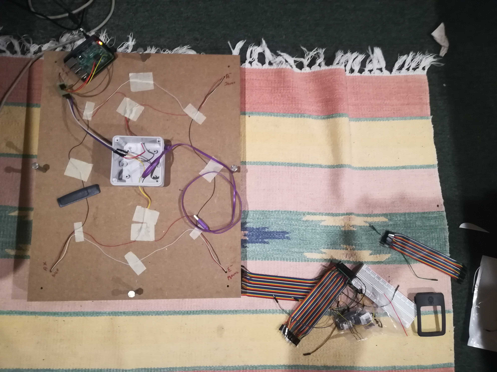

# HoneyHoney project

Python Software developed to build a Raspberry Pi scale, using Weight Sensor HX711.
Main code HoneyHoney.py largely inspired by https://github.com/tatobari/hx711py
Useful tuto to build your scale: https://tutorials-raspberrypi.com/digital-raspberry-pi-scale-weight-sensor-hx711/.

Data are sent to a MQTT broker.

This project was initially developed to remotely control the weigh of a hive, in order to determine the best time for harvest.

Many thanks to Seb ;)

## Preparation

- Using MQTT client with Python

If you want to use this feature, please download the librairy.
For Linux:
```
sudo apt-get install -y python-paho-mqtt
```

- Clone the GitHub project

Go to the /home/pi/ directory and clone the git repository
```
git clone https://github.com/girardcarillo/HoneyHoney.git
```
## Configure the soft
Go to HoneyHoney directory.

The `config.sh` executable writes in `/etc/rc.local` in order to execute the HoneyHoney script at
each boot.
So if you want the `HoneyHoney.py` to be launched at boot, please:
```
sudo ./config.sh
```
Now if you boot your Raspi again, the python process should be running.

## First use of the scale

In the file HoneyHoney.py search for the line
```
hx.set_reference_unit(24)
```
and comment it. Uncomment the line
```
hx.set_reference_unit(referenceUnit)
```
With nothing on the scale, in your terminal run
```
sudo python HoneyHoney.py
```
Some values are printing in your terminal, and the tare of the balance is done, creating a file 'tare.txt' to record the date and time of the tare.

Rq: for our needs, the tare is only done once. If you want to remove this feature, please edit the `tare_A()` method in `hx711.py`.

## Calibrating your scale

The correct calibration of the weight sensor and the Raspberry Pi balance is crucial. For this we need a comparison object whose weight we know.
For example, take two packs of milk (1kg each), but keep in mind it is recommended to choose an average value of the maximum you want to weigh.
Place it on the scale and run the python code again.
The displayed values can be positive as well as negative.
For example, if at 2kg (= 2000 gramm) values around -882000 are displayed, then the reference value is -882000 ÷ 2000 = -41.
Then edit the HoneyHoney.py file in the same way as above described, remove the comment hashtag and enter this value accordingly.
The line now looks as follows:

```
hx.set_reference_unit(-441)
# hx.set_reference_unit(referenceUnit)
```
Rq: if you are using the scale for the first time, a tare operation is done, creating a file 'tare.txt'.
If you want to tare the scale again, you'll have to erase this 'tare.txt' file, and do the calibrating work all over again.

Your scale is ready, you can now weigh the world :honeybee: :honeybee: :honeybee:



