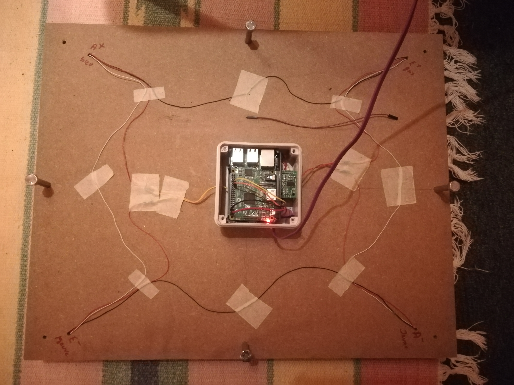

# HoneyHoney project

Software developed to build a Raspberry Pi scale, using Weight Sensor HX711.
Main code HoneyHoney.py largely inspired by https://github.com/tatobari/hx711py 
Useful tuto to build your scale: https://tutorials-raspberrypi.com/digital-raspberry-pi-scale-weight-sensor-hx711/

Data are sent to a MQTT broker.

This project was initially developed to remotely control the weigh of a hive, in order to determine the best time for harvest.

Many thanks to Seb ;)

# Scaling 

